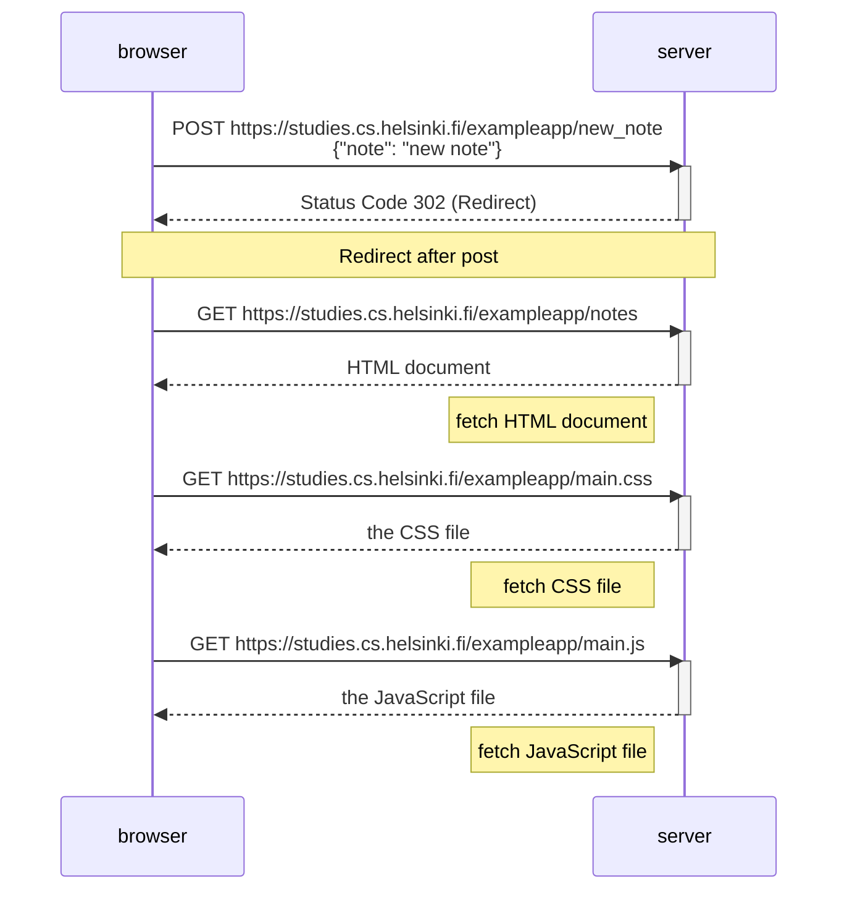

```mermaid
sequenceDiagram
    participant browser
    participant server

    browser->>server: POST https://studies.cs.helsinki.fi/exampleapp/new_note<br/>{"note": "new note"}
    activate server
    server-->>browser: Status Code 302 (Redirect)
    deactivate server

    Note over browser,server: Redirect after post

    browser->>server: GET https://studies.cs.helsinki.fi/exampleapp/notes
    activate server

    server-->>browser: HTML document
    deactivate server

    Note left of server: fetch HTML document


    browser->>server: GET https://studies.cs.helsinki.fi/exampleapp/main.css
    activate server

    server-->>browser: the CSS file
    deactivate server

    Note left of server: fetch CSS file


    browser->>server: GET https://studies.cs.helsinki.fi/exampleapp/main.js
    activate server

    server-->>browser: the JavaScript file
    deactivate server

    Note left of server: fetch JavaScript file
```
