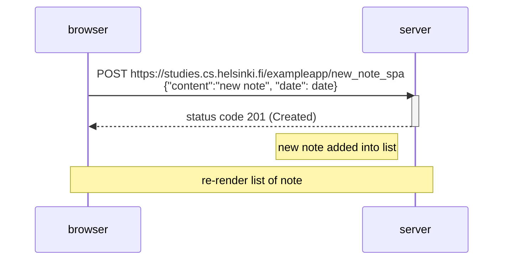

```mermaid
sequenceDiagram
    participant browser
    participant server

    browser->>server: POST https://studies.cs.helsinki.fi/exampleapp/new_note_spa<br/>{"content":"new note", "date": date}
    activate server
    server-->>browser: status code 201 (Created)
    deactivate server

    Note left of server: new note added into list
    Note over browser,server: re-render list of note
```
