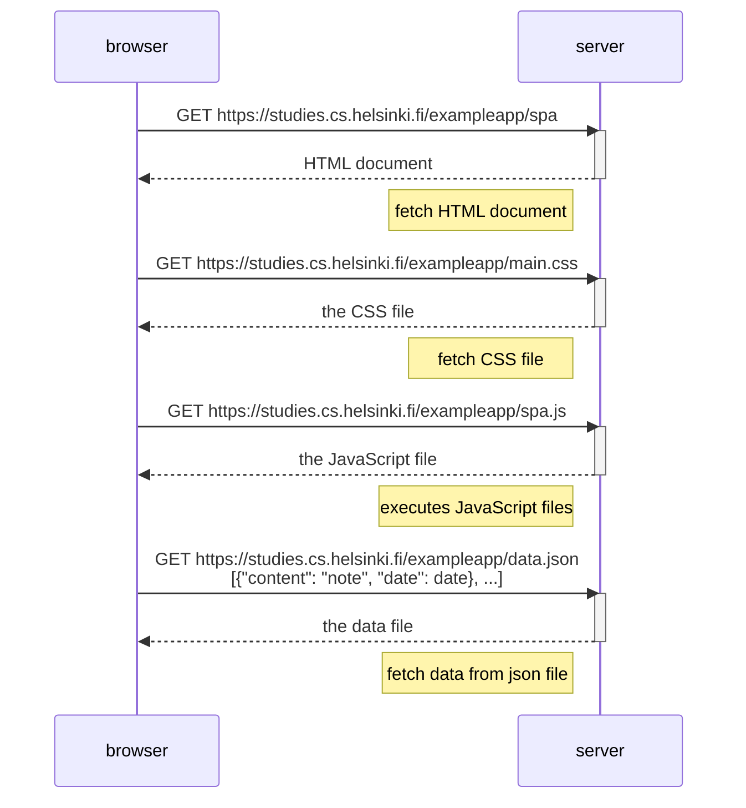

```mermaid
sequenceDiagram
    participant browser
    participant server

    browser->>server: GET https://studies.cs.helsinki.fi/exampleapp/spa
    activate server

    server-->>browser: HTML document
    deactivate server

    Note left of server: fetch HTML document


    browser->>server: GET https://studies.cs.helsinki.fi/exampleapp/main.css
    activate server

    server-->>browser: the CSS file
    deactivate server

    Note left of server: fetch CSS file


    browser->>server: GET https://studies.cs.helsinki.fi/exampleapp/spa.js
    activate server

    server-->>browser: the JavaScript file
    deactivate server

    Note left of server: executes JavaScript files


    browser->>server: GET https://studies.cs.helsinki.fi/exampleapp/data.json<br/>[{"content": "note", "date": date}, ...]
    activate server

    server-->>browser: the data file
    deactivate server

    Note left of server: fetch data from json file
```
